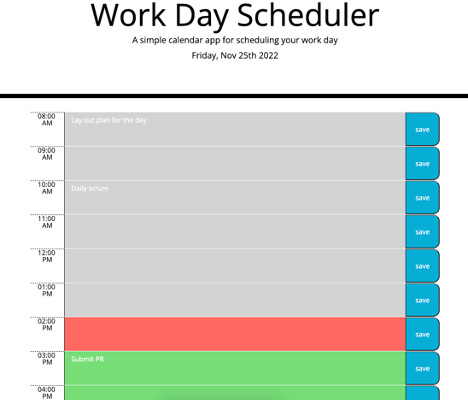

# Day-Calendar

## Description

As an employee with a busy schedule, this daily planner allows you to save new and edited tasks, organized by each hour of a standard work day so that you may manage your time effectively.
The the current day and date is displayed at the top of the calendar for reference, time-blocks are presented by hour from 8am to 5pm, those blocks are color-coded to indicate whether each hour is in the past, present, or future, and when tasks are saved, they persists in the calendar.

## Screenshot

## Deployed Application Link

https://alissacohan18.github.io/DayCalendar/

## Built With
* HTML
* CSS
* JavaScript
* JQuery
* Moment.JS
* BootStrap

## Credits

Starter html and CSS code provided by: GT Coding Boot Camp / Boot Spot

